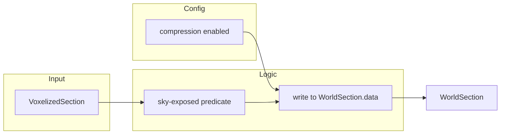

# feature-01: Sky-exposed surface culling + config flag

## Goal

Reduce LOD memory and storage by keeping only blocks that are directly exposed to the sky (no opaque block above them). This is Option 2 from the MVP and the recommended starting point. A config flag gates the behavior so it can be validated without affecting existing worlds.

## Acceptance criteria

- [ ] Config option exists to enable/disable LOD compression (sky-exposed culling); default off.
- [ ] When enabled, only sky-exposed blocks are written into `WorldSection` for the affected LOD path; others are treated as air.
- [ ] Emptiness and `nonEmptyBlockCount` (and parent propagation) remain correct for culled sections.
- [ ] With flag off, behavior is unchanged from current (no culling).
- [ ] Spark metrics show reduction in heap and/or disk when enabled; no crash or visual corruption in overworld smoke test.

## Steps

1. Add config option (e.g. in `run/config/voxyworldgen.json` or existing LOD/world config) for “LOD compression” or “sky-exposed culling”; default `false`.
2. Implement sky-exposed predicate: for a given block index in the section, determine if there is any opaque block above it along the same XZ column, using `Mapper.getBlockStateOpacity` (or equivalent) for opacity. Air and non-opaque blocks count as transparent.
3. In the write path that fills `WorldSection.data` (e.g. `WorldUpdater.insertSectionLvlIntoWorld` or a helper it calls), when config is enabled, for each destination cell either write the source block (if sky-exposed) or write air. Preserve existing indexing (e.g. `baseSec`, `secIdx`) so higher LOD levels and serialization stay consistent.
4. Ensure `nonEmptyBlockCount` and any emptiness/child state updated from this path reflect only the blocks actually written (culled blocks not counted as non-empty).
5. Smoke test: enable flag, load overworld, capture Spark metrics; disable and confirm baseline unchanged.

## Detail (mermaid)

## Testing

- Unit or integration: with compression off, output section data matches current behavior for a known `VoxelizedSection`.
- With compression on: overworld load completes; Spark shows reduced heap and/or disk; no assertion or NPE.
- Visual: compare same area with flag on vs off at same LOD; sky-facing surfaces should match; underground/caves may be culled when enabled.
