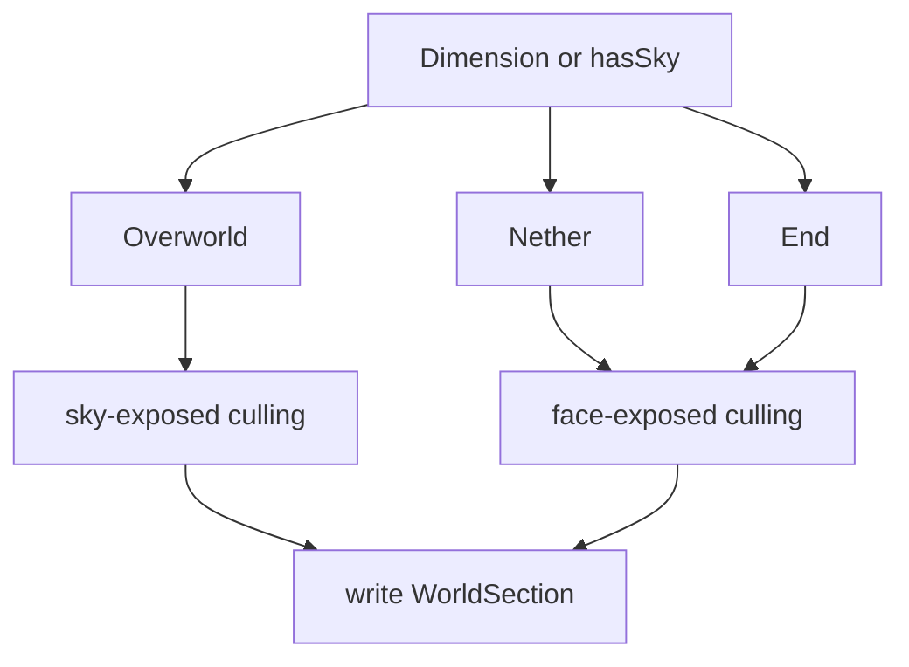

# feature-02: Dimension-aware compression

## Goal

Handle dimensions where “sky” is meaningless (Nether, End). Use face-exposed culling there so terrain is not over-culled; keep sky-exposed culling for Overworld. Also treat water as a surface block so water surface is preserved (MVP edge case).

## Acceptance criteria

- [ ] Dimension (or “has sky”) is available in the compression path (from chunk/section/world context).
- [ ] Nether: face-exposed culling is used (keep block if any of 6 neighbours is non-opaque).
- [ ] End: face-exposed culling is used (preserves floating island undersides).
- [ ] Overworld: sky-exposed culling remains as in feature-01.
- [ ] Water blocks are treated as surface (e.g. water surface kept; logic consistent with MVP table).
- [ ] Loading Nether/End does not remove all terrain; Spark and visual check pass.

## Steps

1. Thread dimension or “hasSky” (or dimension ID) from the caller that invokes the LOD write path (e.g. from chunk source or world) down to the compression logic.
2. Implement face-exposed predicate: for a block, keep it if at least one of the 6 neighbours is air or non-opaque (using Mapper opacity). Handle section boundaries (neighbours in adjacent sections) per existing conventions or clamp to section.
3. In the compression entry point, branch on dimension: Nether/End → face-exposed; Overworld → sky-exposed. Reuse feature-01 sky-exposed when applicable.
4. Water: in the chosen strategy, treat water as a surface block so that water-at-top-of-column (or sky-exposed water) is kept; document any special case in code comment.
5. Test in Nether and End: load region, confirm terrain is visible and not fully culled; run Spark; optional visual comparison with feature-01-only build in same dimensions.

## Detail (mermaid)

## Testing

- Nether: load Nether chunk(s), confirm blocks remain (no full cull); Spark metrics.
- End: load End, confirm floating islands and undersides preserved; Spark metrics.
- Overworld: behavior unchanged from feature-01 (sky-exposed).
- Water: overworld ocean/lake shows water surface when expected.
