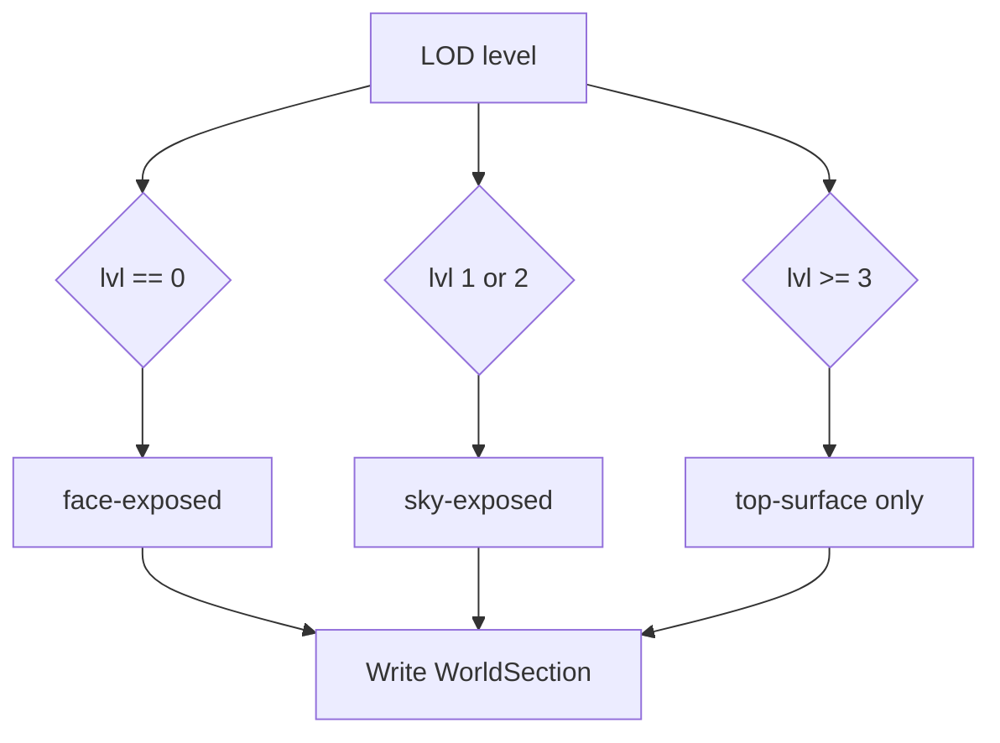

# feature-03: LOD-level-aware compression (Option 4)

## Goal

Apply different compression strategies per LOD level: level 0 (closest) uses face-exposed culling; levels 1–2 use sky-exposed; level 3+ (farthest) use top-surface only. This balances visual quality at close range with maximum reduction at far distance.

## Acceptance criteria

- [ ] LOD level is passed into the compression path and selects strategy: 0 → face-exposed, 1–2 → sky-exposed, 3+ → top-surface only.
- [ ] Top-surface only (Option 1) is implemented: per XZ column, from top to bottom, store the first non-air block and treat the rest as culled (air).
- [ ] Dimension handling from feature-02 still applies (Nether/End use face-exposed where appropriate; can map to level 0 behavior or explicit dimension override).
- [ ] Config allows tuning per-level thresholds or strategy override if needed.
- [ ] Spark benchmarks show expected memory/disk reduction; no visual regression at each LOD level.

## Steps

1. Ensure LOD level is available in the compression call (e.g. `worldSection.lvl` or passed parameter). Add a single entry point that takes (level, dimension, section data) and returns or writes culled result.
2. Implement top-surface-only path: for each XZ column, iterate Y from top to bottom; keep the first non-air block, mark or write air for the rest. Integrate with existing section indexing.
3. Strategy selection: level 0 → face-exposed; level 1 or 2 → sky-exposed; level 3+ → top-surface only. For Nether/End, either keep dimension override (face-exposed for all levels) or apply only at level 0; document choice. Face-exposed strategy at level 0 may use the 5-face checker from feature-05 (excludes -Y) where desired.
4. Add config knobs if needed (e.g. “max level for face-exposed”, “max level for sky-exposed”) for tuning without code change.
5. Run Spark and visual checks at multiple LOD levels; confirm close LODs retain detail and far LODs are heavily compressed.

## Detail (mermaid)

## Testing

- Level 0: overhangs and cave entrances visible (face-exposed).
- Level 1–2: sky-exposed behavior; flat surfaces and rooftops preserved.
- Level 3+: only top surface per column; maximum reduction; Spark shows largest savings at high levels.
- Dimension rules (Nether/End) still respected; no regression from feature-02.
