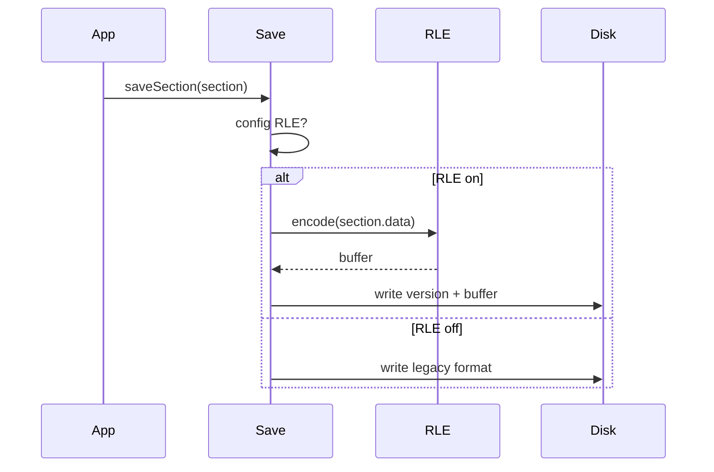

# feature-04: Optional RLE storage layer (Option 5)

## Goal

Add Run-Length Encoding to the LOD section storage layer: serialize `WorldSection.data` as (blockStateId, count) runs to reduce disk size. Deserialize back to the same in-memory `long[]` layout so the rest of the pipeline is unchanged. Feature is gated by config and versioned so existing saves remain loadable.

## Acceptance criteria

- [ ] RLE format is documented (e.g. per-column or per-section runs; how block state IDs and counts are encoded).
- [ ] Serialize path: when RLE config is on, convert `WorldSection.data` to RLE form and write with a version or magic so deserializer can detect RLE vs legacy.
- [ ] Deserialize path: if RLE marker present, decode RLE back to `long[]` and assign to `WorldSection.data`; otherwise use existing deserialize logic.
- [ ] With RLE disabled, behavior and file format unchanged; existing worlds load as today.
- [ ] Spark measures disk size and load time; RLE shows disk reduction without unacceptable load-time regression when enabled.

## Steps

1. Design RLE format: e.g. for each vertical column (or for the whole section in a defined order), output runs of (blockStateId, count). Choose encoding (e.g. varint or fixed width for count; block state ID from existing mapping). Document in this plan or a short design note in code.
2. Implement serialization: in the save path (e.g. `SaveLoadSystem2`/`SaveLoadSystem3` or the active storage implementation), when RLE is enabled, build RLE stream from `section.data`, write version byte or magic, then the RLE payload. Ensure section metadata (e.g. key, level) still written so load can find sections.
3. Implement deserialization: when loading, read version/magic; if RLE, decode runs back into `long[]` of size `WorldSection.SECTION_VOLUME` and set on section; else use existing non-RLE deserialize.
4. Add config flag (e.g. “use RLE for LOD storage”) default off; only new saves or newly saved sections use RLE when enabled. Document that disabling RLE may leave existing RLE sections on disk (backward read must stay supported).
5. Benchmark: save with RLE on, measure disk size vs off; load time with RLE on vs off; ensure no crash and correct in-game appearance.

## Detail (mermaid)

## Testing

- With RLE off: save and load world; behavior unchanged; file format compatible with previous implementation.
- With RLE on: save section, inspect file size (smaller than legacy for typical terrain); load section, confirm `section.data` matches expected block IDs; render or mesh from section to confirm no corruption.
- Spark: compare disk usage and load time RLE on vs off; document tradeoff.
