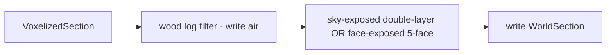

# feature-05: Wood log filter + double-layer sky-exposed + 5-face checker

## Goal

Add wood log culling, double-layer sky-exposed rule, and 5-face-exposed predicate to the LOD compression path. Applied in order: (1) wood log filter, (2) double layer for sky-exposed, (3) 5-face checker for face-exposed strategies.

## Acceptance criteria

- [ ] Wood log blocks (all block states in Minecraft's log tags, e.g. `BlockTags.LOGS` / `BlockTags.LOGS_THAT_BURN`) are always written as air in the compression path.
- [ ] Sky-exposed predicate requires at least two non-opaque blocks above (double layer); `cullToSkyExposed` (or equivalent) updated accordingly.
- [ ] A 5-face-exposed predicate exists: keep block iff at least one of the 5 neighbours (excluding -Y) is air or non-opaque; usable where face-exposed is selected (e.g. dimension or LOD strategy).
- [ ] `nonEmptyBlockCount` and emptiness propagation remain correct after all three changes.

## Steps (implementation order)

### 1. Wood log filter

- In [Mapper](src/main/java/me/cortex/voxy/common/world/other/Mapper.java) (or a small helper used by the culling path), add a way to detect "log" blocks from a mapping ID: e.g. `isLog(long mappingId)` / `isLog(int blockId)` using `getBlockStateFromBlockId` and `BlockState.is(BlockTags.LOGS)` (and optionally `BlockTags.LOGS_THAT_BURN` if not covered).
- In the compression write path (e.g. in or before [WorldUpdater.cullToSkyExposed](src/main/java/me/cortex/voxy/common/world/WorldUpdater.java) and any face-exposed path added in feature-02), when writing a cell, if the block is a log, write air instead.
- Ensure `nonEmptyBlockCount` / emptiness stay correct.

### 2. Double layer for sky-exposed

- In the sky-exposed predicate (currently [WorldUpdater.cullToSkyExposed](src/main/java/me/cortex/voxy/common/world/WorldUpdater.java)), change the "above" check from "no opaque in y+1..15" to requiring at least two cells above non-opaque: both y+1 and y+2 must be non-opaque for the block at y to be kept. If either is opaque, treat as not sky-exposed (write air).

### 3. 5-face checker

- Implement a predicate `faceExposed5Faces(section, mapper, x, y, z)` (or equivalent) that returns true iff at least one of the 5 neighbours **excluding -Y** (+X, -X, +Y, +Z, -Z) is air or non-opaque. Handle section boundaries the same way as the existing 6-face logic in feature-02.
- Expose this so the dimension-aware or LOD-level-aware strategy can choose "5-face" instead of "6-face" where desired (e.g. config or hard-wired for Nether/End or level 0). Document in code where 5-face is used (e.g. "used for face-exposed strategy in Nether/End" or "optional alongside 6-face").

## Testing

- **Wood:** Sections with only logs become empty; mixed sections have logs as air.
- **Double layer:** One layer of leaves/air above solid no longer kept; two layers above kept.
- **5-face:** Blocks only exposed downward are culled; blocks exposed on any of the other 5 sides kept.

## Detail (mermaid)

## Related

- Compression entry: [WorldUpdater.insertUpdate](src/main/java/me/cortex/voxy/common/world/WorldUpdater.java); when `isLodCompressionEnabled()`, calls `cullToSkyExposed` then `mipSection`. No changes to `insertSectionLvlIntoWorld` indexing or SaveLoadSystem3; only culling predicates and data written before insert.
- Face-exposed at level 0 (feature-03) may use the 5-face checker from this feature.
