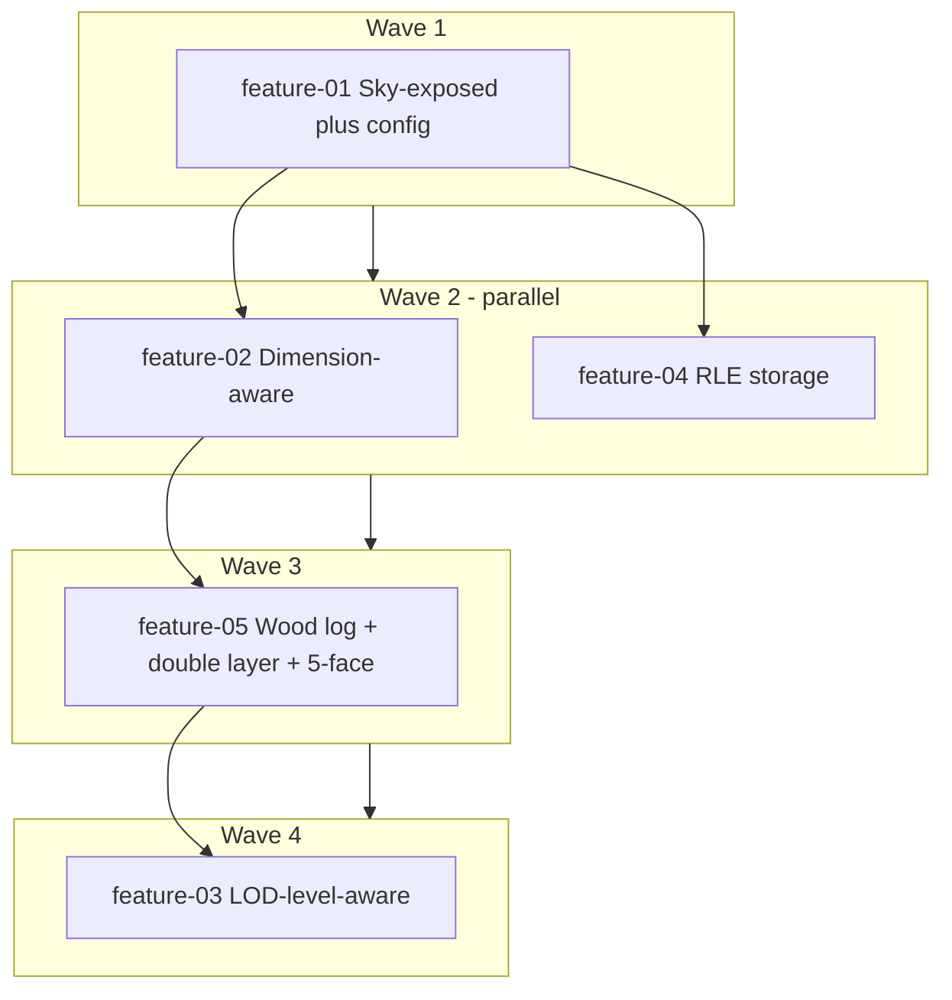

# LOD Compression — Implementation Order

Single source of truth for what to build when. Features in the same wave can be implemented in parallel.

## Progress checklist

- [x] Wave 1: feature-01 (Sky-exposed plus config)
- [x] Wave 2: feature-02 (Dimension-aware)
- [x] Wave 2: feature-04 (RLE storage)
- [ ] Wave 3: feature-05 (Wood log + double layer + 5-face)
- [ ] Wave 4: feature-03 (LOD-level-aware)
