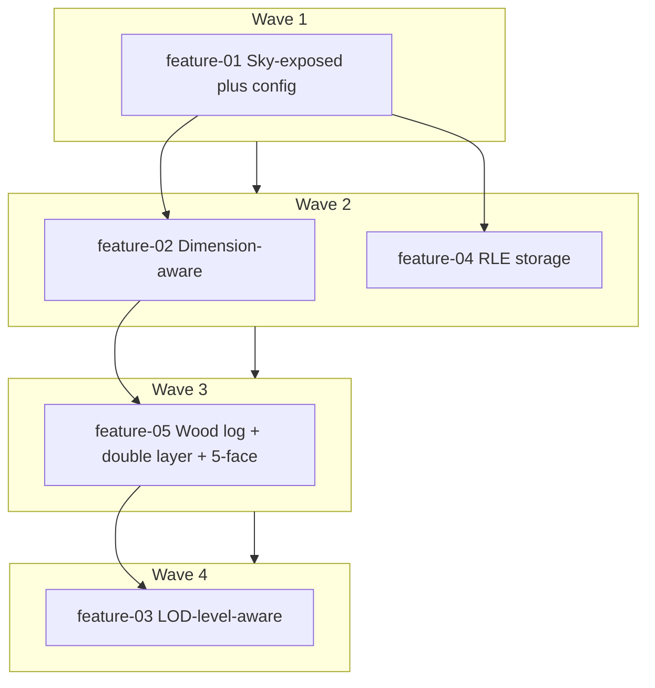

# LOD Compression — Implementation Plan

## Overview

This plan turns the LOD compression MVP (surface-only compression to reduce memory, storage, and GPU bandwidth) into implementable, PR-sized features for the Voxy codebase. Culling is applied per LOD level in `WorldUpdater.insertSectionLvlIntoWorld` (or a dedicated helper invoked from there) so one import produces all levels with level-appropriate compression. Scope is prototype-first with balanced performance: sky-exposed culling first, then dimension awareness, then LOD-level-aware (Option 4), then optional RLE storage.

**Priorities (agreed):**
- Prototype — validate and measure; refactor later if needed
- Scalability: single-user / in-game world; no distributed requirement
- Performance: balanced — good compression without noticeably slowing chunk import
- Other: track with Spark (heap, import time, disk size, FPS); no visual regression at target LOD levels

**Key decisions (user-selected):**
- **Where to apply culling:** In the write path into `WorldSection` (e.g. inside or alongside `WorldUpdater.insertSectionLvlIntoWorld`) per LOD level, so `VoxelizedSection` stays unchanged and each LOD level can use a different strategy (sky-exposed, face-exposed, top-surface).
- **Scope:** Recommended path — Option 2 → dimension handling → Option 4 (LOD-level-aware) → optional RLE (Option 5).

---

## Features list

| ID | Feature | Summary |
|----|---------|---------|
| feature-01 | Sky-exposed surface culling + config flag | Store only blocks with no opaque block above; config toggle to enable/disable. |
| feature-02 | Dimension-aware compression | Nether/End use face-exposed culling where sky is meaningless; overworld keeps sky-exposed. |
| feature-05 | Wood log + double layer + 5-face | Wood logs culled as air; sky-exposed requires two non-opaque above; 5-face predicate (exclude -Y) for face-exposed. |
| feature-03 | LOD-level-aware compression (Option 4) | Level 0: face-exposed; levels 1–2: sky-exposed; level 3+: top-surface only. |
| feature-04 | Optional RLE storage layer (Option 5) | Run-length encode section data at serialize/deserialize for additional disk savings. |

---

## Dependencies and parallel execution

| Feature ID | Depends on | Can run in parallel with |
|------------|------------|---------------------------|
| feature-01 | None | — |
| feature-02 | feature-01 | — |
| feature-05 | feature-01, feature-02 | — |
| feature-03 | feature-01, feature-02, feature-05 | — |
| feature-04 | feature-01 | feature-02, feature-03 (only touches storage layer) |

**Diagram (dependency and waves):**

---

## Feature breakdown (PR-sized units)

### feature-01: Sky-exposed surface culling + config flag
- [ ] **1.1** Add config option (e.g. in worldgen or LOD config) to enable/disable LOD compression; default off for prototype.
- [ ] **1.2** Implement sky-exposed predicate: for each block in section, determine if any opaque block exists above it (using Mapper opacity); treat air and non-opaque as transparent.
- [ ] **1.3** In the LOD write path (e.g. `WorldUpdater.insertSectionLvlIntoWorld` or called helper), when config enabled, only write block data for sky-exposed blocks; leave others as air (or existing convention for “empty”).
- [ ] **1.4** Ensure `nonEmptyBlockCount` and emptiness propagation remain correct for culled sections.
- [ ] **1.5** Smoke test: enable flag, load overworld, confirm no crash and Spark metrics show memory/disk reduction; disable flag and confirm unchanged behavior.

### feature-02: Dimension-aware compression
- [ ] **2.1** Pass dimension or “has sky” flag into the compression path (from chunk/section context).
- [ ] **2.2** For Nether/End (no sky): use face-exposed culling instead of sky-exposed (keep block if any of 6 neighbours is non-opaque).
- [ ] **2.3** For Overworld: keep sky-exposed behavior.
- [ ] **2.4** Water: treat water as surface block (keep water surface; MVP edge case).
- [ ] **2.5** Test in Nether and End: no full culling of terrain; Spark + visual check.

### feature-03: LOD-level-aware compression (Option 4)
- [ ] **3.1** Add per-LOD strategy selection: level 0 → face-exposed; levels 1–2 → sky-exposed; level 3+ → top-surface only (first non-air from top per column).
- [ ] **3.2** Implement top-surface-only path (Option 1) for level 3+.
- [ ] **3.3** Wire level and dimension into single compression entry point so each (lvl, dimension) gets the right strategy.
- [ ] **3.4** Config: allow override or thresholds per level if needed for tuning.
- [ ] **3.5** Benchmark with Spark; confirm no visual regression at each LOD level.

### feature-04: Optional RLE storage layer (Option 5)
- [ ] **4.1** Design RLE format for section block data: e.g. (blockStateId, count) pairs per column or per section; document in feature plan.
- [ ] **4.2** Implement serialize path: convert `WorldSection.data` to RLE form in a buffer; write version or flag so deserializer can detect RLE vs legacy.
- [ ] **4.3** Implement deserialize path: decode RLE back to `long[]` for `WorldSection.data`; keep compatibility with non-RLE saves.
- [ ] **4.4** Gate behind config (e.g. “use RLE for LOD storage”) so existing worlds remain loadable.
- [ ] **4.5** Measure disk size and load time with Spark; ensure no regression when disabled.

---

## Edge cases (from MVP)

| Case | Solution (in plan) |
|------|--------------------|
| Nether | feature-02: face-exposed culling |
| End | feature-02: face-exposed culling |
| Water | feature-02: treat water as surface block |
| Overhangs | feature-03: face-exposed at level 0 |
| Floating islands | feature-02/03: face-exposed keeps undersides |
| Modded blocks | Use `Mapper.getBlockStateOpacity` / opacity checks consistently |

---

## Success metrics (Spark)

- Reduction in heap memory during LOD loading
- Reduction in chunk import time (ms per chunk)
- Reduction in LOD database size on disk
- FPS improvement at far render distances
- No visual regression at target LOD levels

---

## Reflection checklist (for reviewer)

- **Core features vs goals:** Each of feature-01–04 maps to the MVP’s recommended order and the goal of reducing memory/storage/bandwidth without visual regression; RLE is optional and additive.
- **Design-flaw check:** Culling is applied at write time; serialization remains compatible (same `WorldSection.data` layout) until feature-04, which is gated and versioned. Dimension and LOD level are explicit inputs to avoid wrong strategy per context.
- **High-impact flexibility:** Data layout stays as `long[]` in memory; only serialization format may change with RLE (behind config and version). Config toggles allow turning off compression or RLE without code change.
- **Alignment:** Plan implements the agreed “recommended scope” and “balanced” performance; deliverables are main plan, implementation-order.mmd, and one feature plan file per feature.
